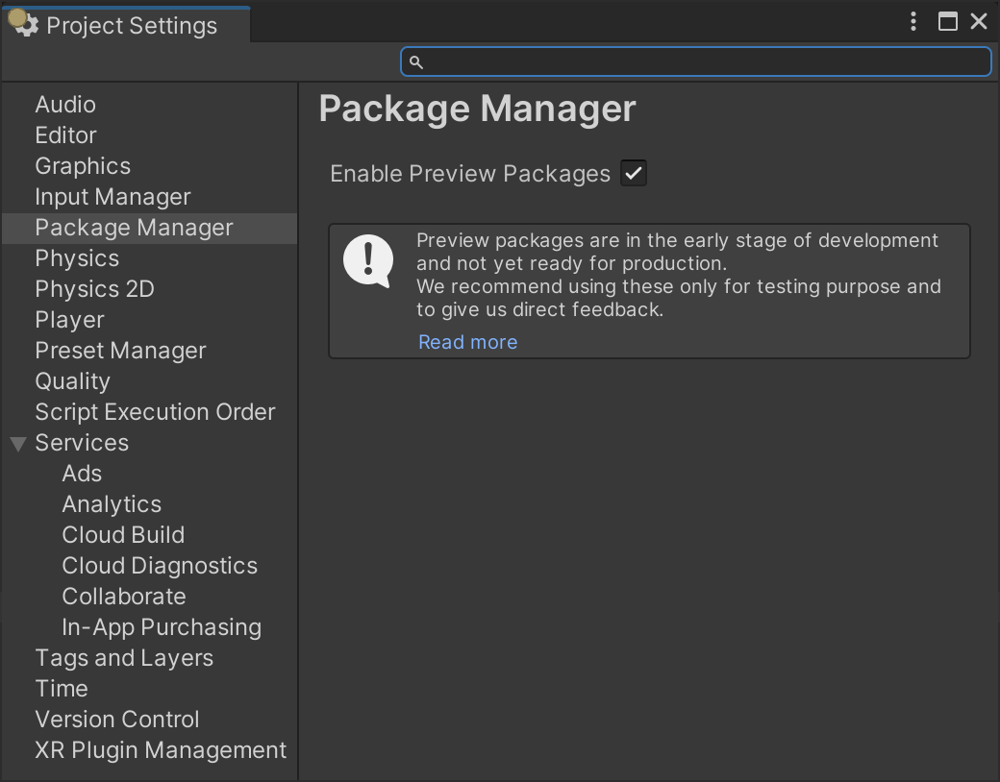
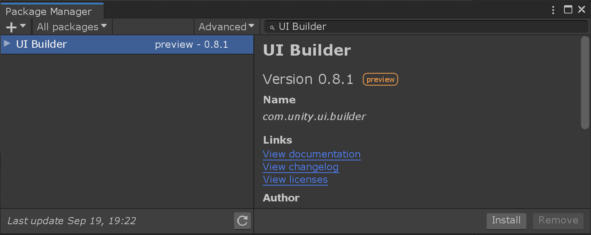
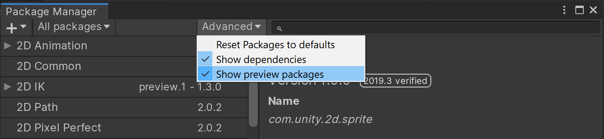

# Overview

The **UI Builder** lets you visually create and edit UI assets such as UI Documents (UXML / `.uxml` assets), and StyleSheets (USS / `.uss` files), that you use with Unity's **UI Toolkit** (formerly UIElements). After you set up the UI Builder package, you can open the UI Builder window from the menu (**Window > UI Toolkit > UI Builder**), or from the Project window (double-click a `.uxml` asset).

> Note: In Unity 2019.x, you open the UI Builder from the **Window > UI > UI Builder** menu.

> Note: UI Builder is the visual authoring tool for UI Toolkit. It does not include runtime support. To enable runtime support in Unity 2020.1 and later, install the UI Toolkit package. For details, see this post on the Unity Forum: https://forum.unity.com/threads/ui-toolkit-1-0-preview-available.927822/.

## The main UI Builder window

1. **StyleSheets**: Manage StyleSheets and USS Selectors to share styles across UI Documents (UXML) and elements.
1. **Hierarchy**: Select, reorder, reparent, cut, copy, paste, delete elements in the UI hierarchy of your document.
1. **Library**: Create new elements or instance other UI Documents (UXML).
1. **Viewport**: See what your UI Document (UXML) looks like and edit elements visually directly on the Canvas.
1. **Code Previews**: See what the UI Builder is creating as text for both the UI Document (UXML)
 and the StyleSheets (USS).
1. **Inspector**: Use it to change the attributes and style properties of the selected element or USS selector.

## Setting up the UI Builder

### Installation

#### Unity 2021.1 or newer

UI Builder comes built-in starting in Unity 2021.1. There is no need to install the package unless you want to try features or fixes earlier.

#### Unity 2020.x

You can install UI Builder as a package, called `com.unity.ui.builder`, by:

1. Going to **Edit > Project Settings... > Package Manager**, and enable check **Enable Preview Packages**:
    
1. Going back to the **Window > Package Manager**.
1. Searching for `UI Builder`:
1. Pressing **Install**.

#### Unity 2019.4

You can install UI Builder as a package, called `com.unity.ui.builder`, by:

1. enabling **Advanced > Show preview Packages**: 
1. going back to the **Window > Package Manager**.
1. searching for `UI Builder`:
1. pressing **Install**.

### Additional functionality from optional packages

UI Builder exposes additional functionality if certain packages are detected in the project.

#### Vector graphics

You can install the `com.unity.vectorgraphics` package to have the UI Builder expose the ability to assign a `VectorImage` as a background style on an element.

#### 2D Sprites support

[!include]

You can install the `com.unity.2d.sprite` package to have the UI Builder expose the ability to assign a 2D Sprite asset (or sub-asset) as a background style on an element. With the 2D Sprite package installed, you will also have the ability to open the 2D Sprite Editor directly from the **Inspector** pane.

#### Rich Text support

[!include]

You can install the TextMeshPro package (installed by default in new projects) to have the UI Builder expose Rich Text features. These features include:
1. Ability to use rich text tags in `Label` text attributes.
1. Ability to use the more advanced `Font Asset` in style properties, that allows setting text highlights and shadows.
