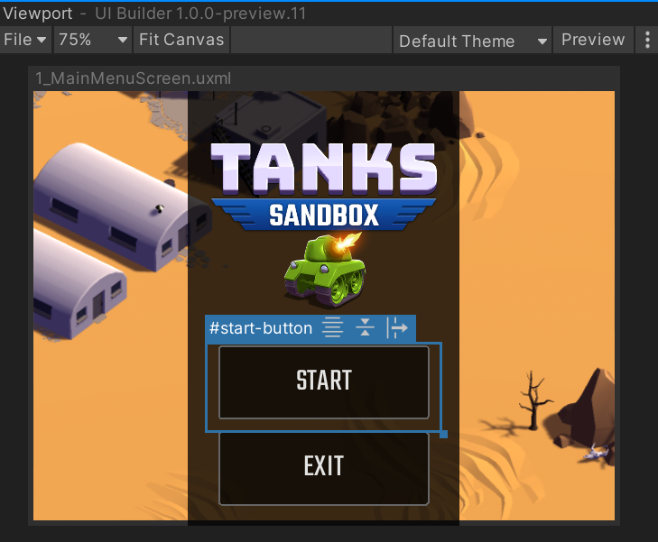
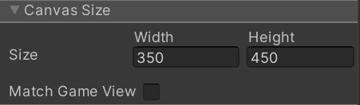
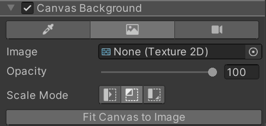

# Setting up the edit-time Canvas

Within the **Viewport** pane, you can find the **Canvas**, a floating re-sizable edit-time container that contains a live version of the UI Document (UXML) being edited. If you can't see it, try clicking on the **Fit Canvas** button in the **Viewport** toolbar to bring it into view. Any settings related to the **Canvas**, like its size, are not saved as part of the UI Document (UXML) but will be remembered (using an internal separate settings file) for the next time you open the same UI Document (UXML).

You can directly resize the **Canvas** inside the **Viewport** by dragging its edges or corners. For exact sizing, you can click on the header of the **Canvas** to access its settings via the **Inspector** pane, where you will see fields for **Canvas** height and width. In the same section, you can also lock the **Canvas** size to the size of the Unity Game Window using the **Match Game View** checkbox to better match a runtime UI environment: 

With the **Canvas** selected, in the **Inspector**, you can change the **Canvas** background to make editing the UI in context easier. You can set it to be a solid color, a specific texture (ie. a mockup from a UI Designer), or a live view from a **Camera** in the currently open Unity Scene: 
