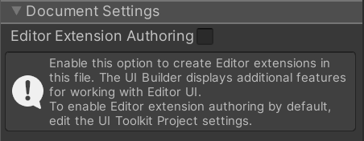

# Runtime UI vs Editor Extension Authoring

By default, UI Builder assumes UI is being created for use at runtime in a Player build. As such, all new UI Documents (UXML) created in the UI Builder have a setting saved within the UXML that marks them as runtime-only UI. The main effect this has in the UI Builder is that the **Library** pane's **Standard** tab will be filtered to only contain elements that work best at runtime.

## Enabling Editor Extension Authoring for the current UI Document (UXML)

If you wish to create UI for use within the Unity Editor, like custom Editor Windows or custom Inspectors, you should enable **Editor Extension Authoring** on your UI Document (UXML). You can do this either by:
1. Selecting the **Canvas** by clicking on its header and in the **Inspector** enabling the **Document Settings > Editor Extension Authoring** option:<br><br> Note, unlike the other **Canvas** settings, this setting will be saved as part of the UI Document (UXML) using a `<UXML>` root tag attribute called `editor-extension-mode`.
1. Clicking the **&#8942;** menu in the top-right corner of the **Library** pane and selecting **Editor Extension Authoring**.

With **Editor Extension Authoring** enabled, you should see additional elements in the **Library** pane's **Standard** tab. Editor-only elements will be marked with an `Editor Only` pill.

## Setting Editor Extension Authoring mode default for new UI Documents (UXML)

You can set the default setting for **Editor Extension Authoring** on new UI Documents (UXML) by:
1. going to **Project Settings** in Unity,
1. finding **UI Builder**,
1. and changing the **Enable Editor Extension Authoring by Default**.

## The Editor Extension Authoring attribute

Every UI Document (UXML) opened in UI Builder has an Editor Extension Authoring attribute. The UI Builder adds the attribute to the UI Document's root tag (the `<UXML>` tag, where you also specify attributes like namespace prefixes), as in the following example:

```xml
<ui:UXML xmlns:ui="UnityEngine.UIElements" xmlns:uie="UnityEditor.UIElements" editor-extension-mode="False">
```

> [!NOTE]
> Because the Editor extension authoring attribute is saved in the UI Document (UXML) file, it is version controlled.
When you create a new UI Document (UXML), the UI Builder sets its Editor Extension Authoring attribute according to the default specified in the UI Builder project settings.

UI Documents (UXML) that you create outside of the UI Builder (for example, in a text editor or IDE) do not have an Editor Extension Authoring attribute until you open them in the UI Builder. When you open an externally created UI Document (UXML) in the UI Builder for the first time, the Editor Extension Authoring attribute is set according to the default specified in the UI Builder project settings.