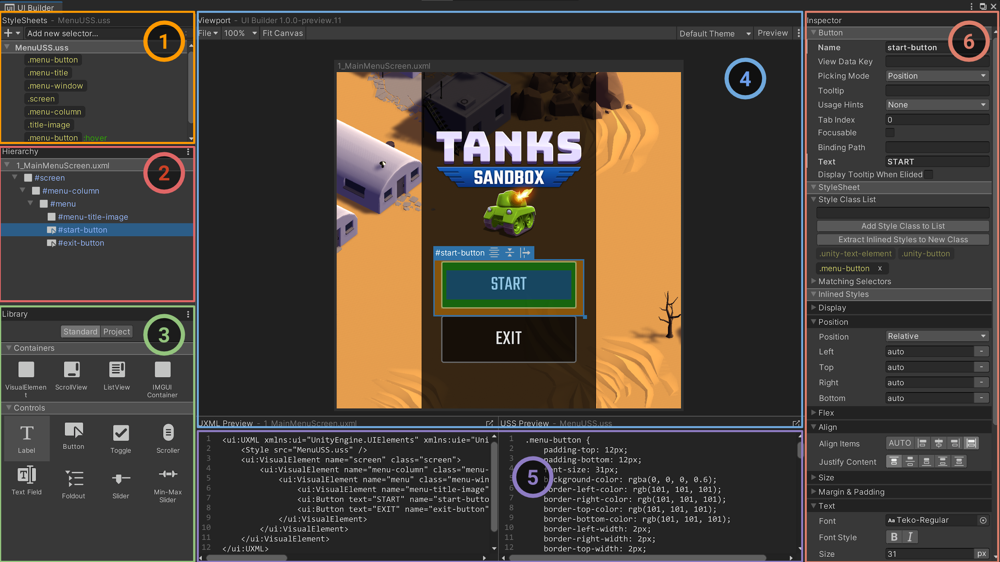

# Interface overview

This is the main UI Builder Editor Window:

## StyleSheets

StyleSheets and the USS Selectors within in UI Toolkit are used to share and apply styles across many elements and many UI Documents (UXML).

The **StyleSheets** pane  is where you can:
1. Add, reorder, or remove StyleSheets (USS) to the current UI Document (UXML).
1. Create, reorder, copy, or remove USS Selectors within StyleSheets for sharing styles across many elements.

## Hierarchy

The **Hierarchy** pane  contains the tree view representing the element hierarchy of the current document. It is a superset of the hierarchy you see in the UXML text representation of the UI Document (UXML). Besides the elements created directly from UXML, the **Hierarchy** pane also contains elements created dynamically and only exist in the runtime of the UI. For example, the **Hierarchy** pane includes elements that are part of a Template instance (a different document instanced inside the current document), where the UXML would just has a single `<Instance>` tag.

You can use the **Hierarchy** pane to:
1. Select elements for inspecting or editing.
1. Cut, copy, delete, or reorder elements.
1. Open instanced template documents as sub-documents for in-place (in context) editing.
1. See at once many elements' style class lists, name attributes, and locally attached StyleSheets.

Elements appear in the tree according to their `name` attributes. If an element's `name` attribute is not set, it appears according to its C# type. You can double-click an element to quickly rename it.

Click the **&#8942;** icon in the top right corner of the **Hierarchy** pane header to access a menu of display options.

- Select **Type** to force the **Hierarchy** to display each element's C# type, regardless of whether it has a name.
- Select **Class List** to display each element's style class list next to its **Hierarchy** entry.
- Select **Attached StyleSheets** to display any locally attached StyleSheets next to their element.

## Library

The **Library** pane  is similar to the [**Project** window](https://docs.unity3d.com/Manual/ProjectView.html) in the Unity Editor. It lists available UI elements.
- The **Standard** tab lists the standard built-in elements that Unity provides. These elements include standard styling that works for all supported Unity Editor and runtime themes.

    You can change this view mode between tiles and tree view using the **&#8942;** icon in the top right corner of the **Library** window and choosing **Tree View**.
- The **Project** tab lists custom `.uxml` assets in the Project. It also lists any custom C# elements that inherit from `VisualElement` and have their `UxmlFactory` set up to be instantiable via UXML. To preview any element in the **Library**'s Project tab, hover over it. The preview appears to the right of the **Library** pane.

To instantiate an element, do one of the following:
- Drag it into the **Hierarchy** pane.
- Drag it onto the **Canvas** in the **Viewport**.
- Double-click it. This adds the element as a sibling of the currently selected element. If nothing is selected, the element is added at the root of the UI Document (UXML).

## Viewport

The **Viewport** pane  displays the output of a UI Document (UXML) on a floating resizable edit-time **Canvas**.

- The header of the **Canvas** displays the name of the currently loaded UI Document (UXML). An asterisk **&#42;** next to the name indicates unsaved changes.
- The toolbar contains menus of UI Builder-specific commands, **Viewport** settings, **Theme** selector, and the **Preview** button.
- You can find additional UI Builder settings in the top-right corner of the **Viewport** under the **&#8942;** menu, including a shortcut to the UI Builder's Settings in Unity's **Project Settings**.
- The **Canvas** is where you edit, preview, and interact with the UI Document (UXML) you are authoring.
- You can change **Canvas** settings by clicking on the **Canvas** header and accessing the **Inspector**.

[!include]

### Navigating in the viewport

Pan and zoom to navigate in the viewport. The UI Builder saves each UI Document (UXML)'s current pan and zoom state, and restores them after the UI Builder window reloads, a domain reload, or when you close and re-open the same UI Document (UXML).

When you create and open a new document, the UI Builder resets the pan and zoom states.

To pan, do one of the following:

1. Middle-click and drag in the **Viewport**.
1. Hold down **Ctrl/Cmd** + **Alt**/**Option** and click and drag in the **Viewport**.

To zoom in and out, position the mouse pointer in the **Viewport** and do one of the following:

1. Position the mouse pointer in the viewport, and rotate the mouse wheel.
1. Hold down **Alt**/**Option** and right-mouse drag. Drag right to zoom in, and left to zoom out.

## Code Previews

As you build your UI, UI Builder automatically generates the underlying UXML and USS text, and displays them in the **UXML Preview** and **USS Preview** panes .

## Inspector

The UI Builder **Inspector** pane  is similar to the Unity [**Inspector** window](https://docs.unity3d.com/Manual/UsingTheInspector.html). The **Inspector** will display slightly different content depending on the type of object you have selected inside the UI Builder:
1. Elements display an **Attribute** section for per-element (UXML) attributes, a **StyleSheets** section for assigning style classes and viewing what styles are being applied from StyleSheets, and an **Inlined Styles** section that allows editing of inline per-element style properties.
1. USS Selectors display a **Style Selector** section for changing the selector query string and a **Styles** section for editing of style properties.
1. Canvas displays a **Canvas Size** section for changing the Canvas size, a **Canvas Background** section for changing the edit-time canvas background, and a **Document Settings** section for per-document edit-time settings.

[!include]