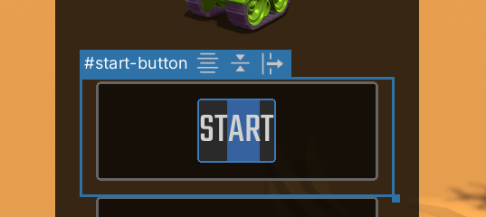

# Changing per-element (UXML) attributes

## Attributes in UXML

Elements have per-element attributes which can be set in UXML. You can think of them as constructor or initialization arguments. This includes the `name` attribute. The base `VisualElement` class comes with a few standard attributes that all elements share (since all elements inherit from `VisualElement`), like: `name`, `tooltip`, and `tabindex`. More advanced elements and controls will have additional attributes you can set, for example, the `Label` adds the `text` attribute.

A small note on the `text` attribute. The `text` attribute supports multi-line text. Just use **Enter** to add newline characters in the **Inspector**.

## Changing attributes in the Inspector

All attributes, both standard and custom, appear at the top of the **Inspector** in a section that has the same name as the name of the element's type. For example, if you click on a `Button`, look for a section in the **Inspector** called **Button**.

You can set the value of an attribute by changing the corresponding field in the attribute section. If the field appears **bold** with a solid line on the left of the field's label, it means the attribute is already set and not using the default. For example, setting `tooltip` from empty to "test" and then back to empty is different from never setting it in the first place: the first case is "unset" while the second case is "set to empty". What "this attribute is set" really means is: "there's an entry in the UXML text on this element setting this attribute to _a_ value". If the attribute is not mentioned in the UXML text, it is "not set".

There is an advantage to leaving fields unset as much as possible in case defaults change. You can _unset_ an attribute by right-clicking on the field's label and choosing **Unset**. You can _unset_ all attributes, including the `name` attribute, by right-clicking on any attribute field and choosing **Unset All**.

## Changing attributes in the Canvas

The only attribute that can be currently changed directly in the **Canvas** is the `text` attribute on text elements. To change the `text` attribute on something like a `Button` or a `Label` you can double-click on it in the **Canvas**. A temporary text field will appear, using the same font settings as the original text: 

Pressing **Enter** will commit the change, unless the `text` attribute already contained newline characters, in which case **Shift + Enter** will be required to commit the change. Pressing **Esc** will cancel any changes.