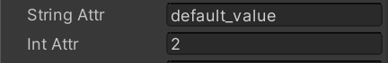

# Using custom (C#) elements

Custom C# elements are a useful way to embed complex UI-related functionality directly in the UI code. For example, take the `IntegerField` control. This is a single custom C# element that appears and behaves like a single atomic element in both UXML and in UI Builder, but internally it creates a complex hierarchy of elements and manages user input, data validation, bindings, and a state machine.

You can create a new custom C# element in C# by inheriting from the `VisualElement` class. This will allow you to create and use this element in C# but will not automatically expose it in UXML and UI Builder. To expose your new element type in UXML and UI Builder, you need the `UxmlFactory` defined, like this:
```C#
class MyElement : VisualElement
{
    public new class UxmlFactory : UxmlFactory<MyElement, UxmlTraits> { }
}
```
After you add the `UxmlFactory` to your class, you will be able to create your element in UXML via the `<MyElement>` tag and find it in the UI Builder's **Library**, under the **Project** tab, in the **Custom Controls (C#)** section. Further categorization will be created if your class is in a namespace.

You can expose additional custom UXML attributes like this:
```C#
class MyElement : VisualElement
{
    public new class UxmlFactory : UxmlFactory<MyElement, UxmlTraits> { }

    public new class UxmlTraits : VisualElement.UxmlTraits
    {
        UxmlStringAttributeDescription m_String =
            new UxmlStringAttributeDescription { name = "string-attr", defaultValue = "default_value" };
        UxmlIntAttributeDescription m_Int =
            new UxmlIntAttributeDescription { name = "int-attr", defaultValue = 2 };

        public override IEnumerable<UxmlChildElementDescription> uxmlChildElementsDescription
        {
            get { yield break; }
        }

        public override void Init(VisualElement ve, IUxmlAttributes bag, CreationContext cc)
        {
            base.Init(ve, bag, cc);
            var ate = ve as MyElement;

            ate.stringAttr = m_String.GetValueFromBag(bag, cc);
            ate.intAttr = m_Int.GetValueFromBag(bag, cc);
        }
    }

    public string stringAttr { get; set; }
    public int intAttr { get; set; }
}
```
UI Builder adds one additional requirement on top of what is already required for pure UXML attributes to work. UI Builder requires your element class to expose a `{ get; set; }` C# property that has the same name as the name you set in your `Uxml*AttributeDescription`, except instead of dashes, the C# property name needs to be using `camelCasing`. For example, if your UXML attribute is named `my-int`, the C# property name should be `myInt`. This is because the UI Builder relies on these C# properties to read the value of the C# attributes to populate its **Inspector** pane.

Here's what the above custom attributes look like in the **Inspector** pane:<br>


UI Builder currently does not support fully custom Inspectors for custom C# elements.