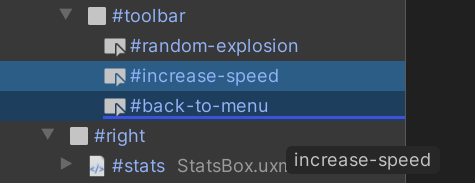
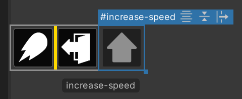

# Working with elements

## Basics

The basic workflow in UI Builder starts with you creating some elements by dragging elements from the **Library** pane onto the **Hierarchy**. UI in UI Toolkit is built and layed out as a hierarchy of elements. The hierarchy dictates which elements are on top of other elements and the order in which elements appear visually in the UI. It is similar to a transform hierarchy in a Unity Scene, except width and height are also influenced by an element's parent or children. Another difference is that depending on which style properties are assigned, some children will drive the size of their parents, while some parents will impact the size of their children.

The basic construction block and base class for all elements in UI Toolkit, is the `VisualElement` class. It serves as the main container element used to create complex layouts. For example, to have a `Button` anchored to the bottom right of the screen, you would need this hierarchy of `VisualElements`:
```C
VisualElement #screen { flex-grow: 1; justify-content: flex-end; }
    VisualElement #bottom-container { flex-direction: row; justify-content: flex-end; }
        Button
```

## Selecting elements

You can select elements by clicking on them, both in the **Hierarchy** and in the **Canvas**. In the **Hierarchy**, holding down **Ctrl / Cmd** will let you select additional elements. In the **Canvas**, if you click again in the same spot on top of an element you will select its parent element, which can be repeated more to selected parents of parents until looping back to the original element.

## Creation, reordering, and re-parenting

When you create elements from the **Library** pane, UI Builder will try to preserve their defaults with some exceptions. By default, elements will not get a name so they will appear in the **Hierarchy** using their type name. You can name them by double-clicking on the item in the **Hierarchy** or by selecting an element and finding the **Name** attribute in the **Inspector**. Worth noting that names in UI Toolkit are not enforced to be unique so they can only be used for identification within your own UI. UI Builder will not use element names for any internal identification or functionality.

To build a hierarchy, you can drag one or more elements in the **Hierarchy** to reorder them or move them between parents:<br>


You can also drag elements into and from the **Viewport** **Canvas**, where a **yellow line** will appear to show you where the element will be placed:<br>


## Manipulation

You can **cut/copy/paste/duplicate/delete** one or more elements simply by selecting them, right-clicking on one, and selecting the option in the right-click menu - or by using the standard short-cut keys.

When you copy an element in the **Hierarchy** pane, what actually gets copied to the copy/paste buffer is the UXML text representation of the element and its children. This means you can paste it in a text editor directly or, the opposite, copy some UXML text and paste it in the UI Builder.

All actions you do to an element are actually applied to all its children as well. For example, deleting an element deletes all its children and duplicating an element will replicated the entire sub-tree of elements under it.

## Read-only elements

You might see additional elements being created in the **Hierarchy** as children of an element that was just dragged from the **Library** folder. These child elements will appear grayed out in the **Hierarchy**. This happens because some custom elements, like most elements in the **Standard** tab of the **Library**, create their internal hierarchy upon creation. This internal hierarchy cannot be edited in the UI Builder because the UI Builder can only edit what it can represent in the UI Document (UXML) it is editing. If you look at the UXML, these internal hierarchies don't exist. UXML is more like an instruction set and not an 1-to-1 copy of the live UI hierarchy.