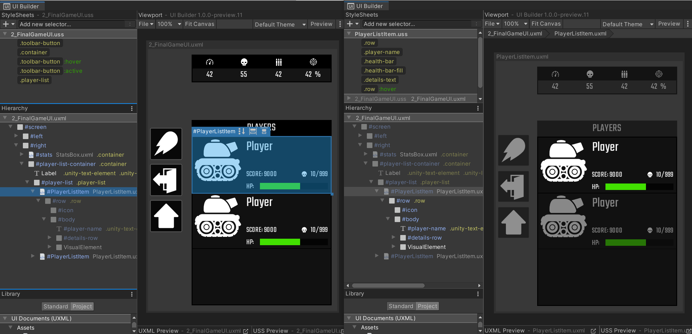

# Instancing UI Documents (UXML) as templates

You can instantiate other existing UI Documents (UXML) (as **Templates**) inside your current UI Document (UXML) (as **Template Instances**), similar to how Prefabs work in Unity. You can do this by going to the **Library**'s **Project** tab, finding the UXML Asset (`.uxml`) you wish to instantiate, and dragging it into the **Hierarchy** like any other element in the **Library**.

A **Template Instance** appears in the **Hierarchy** like a normal element of type `TemplateContainer` with the name of the `.uxml` file in faded font to the right of its name. If you expand the **Template Instance** you can see the internal hierarchy that it comes with. This internal hierarchy, as explained in [Working with elements](uib-structuring-ui-elements.md), is read-only and only shown for reference. To make edits to this hierarchy you will need to edit the original UI Document (UXML).

UI Builder offers three main ways of editing an original UI Document (UXML) being used as a **Template Instance**. To access these options, you can right-click on a **Template Instance** and choose:
1. **Open in UI Builder**: This will unload the current UI Document (UXML) and load the UI Document (UXML) being instanced: 
1. **Open as Sub-Document**: This will keep the current UI Document (UXML) loaded in the background while loading the UI Document (UXML) being instanced in the forefront. The **Hierarchy** and the **Canvas** will only show the contents of the **Sub-Document**, while the **StyleSheets** pane will include the StyleSheets of the background parent UI Document (UXML) but in a readonly state. This is because those StyleSheets are still being applied to the **Sub-Document**: 
1. **Open as Sub-Document In-Place**: This will keep the current UI Document (UXML) loaded while making all of its elements read-only and grayed out in the **Hierarchy** and the **Canvas**. At the same time, this mode will enable the editing of the contents of the UI Document (UXML) being instanced _in-place_ within the context of the parent UI Document (UXML). This is the ideal mode for making quick changes to **Template Instance** content without losing the context of the host document: 

For cases (2) and (3) above, a _breadcrumb_ will appear above the Viewport indicating this state, especially since this action can be repeated on a **Template Instance** inside the original **Template Instance**, recursively. The _breadcrumb_ can be used to go back to a parent UI Document (UXML). Both, going into a Sub-Document and back to the parent document will require a full save: 
