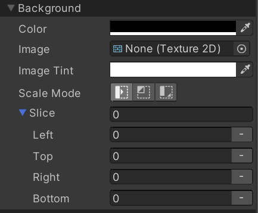

# Setting background images

There is no dedicated "image" element in UI Builder. To create an image in UI Builder, simply create a regular `VisualElement` and set its **Background > Image** to any image you wish. Here's a preview of the background related style properties in the **Inspector**: 

> [!NOTE]
> It is recommended to avoid using the **Slice** background style properties. You can use **Slice** to set up 9-slicing on an image, however, it is specific to the element itself and not the image. In 2021.1+, the recommended approach will be to use the existing 9-slicing support in the **2D Sprite Editor** and 2D Sprite assets. See point (2) below.

By default, any regular texture image will work in UI Builder. You can add support for additional asset types by installing some optional packages:
1. You can install the `com.unity.vectorgraphics` package to have the UI Builder expose the ability to assign a `VectorImage` as a background style on an element.
1. (Unity 2021.1+) You can install the `com.unity.2d.sprite` package to have the UI Builder expose the ability to assign a 2D Sprite asset (or sub-asset) as a background style on an element. With the 2D Sprite package installed, you will also have the ability to open the 2D Sprite Editor directly from the **Inspector**.