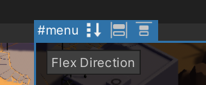
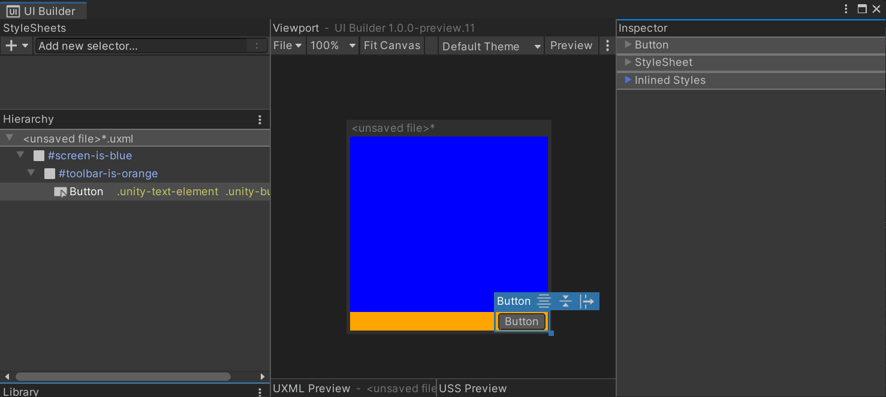
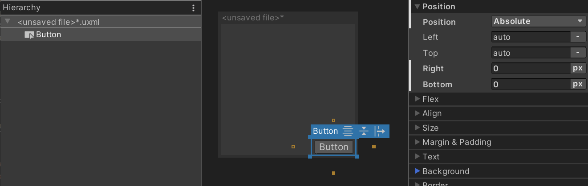
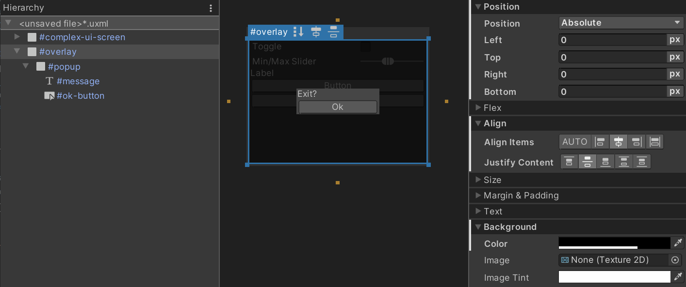

# Positioning elements

## Relative position and flexbox

UI Toolkit uses a modified version of Yoga, an implementation of the flexbox layouting engine. Flexbox is a common layouting engine found on the web and is controlled via USS style properties. Some of the main style properties are:
* **Flex > Direction** (`flex-direction` in USS): Set the direction in which elements are layed out, or the **main-axis**. The default is `column` and that means that, without any other overrides, the first child under a parent with this style property will appear _above_ the second child, the second child above the third child, and so on, in a column.
* **Flex > Grow** (`flex-grow` in USS): This property defines how an element should grow in the **main-axis**. It's a ratio that is shared with all other siblings of the same parent. Usually, this property is most useful when trying make an element stretch to take up the entire size of its parents (minus any siblings). To do this, set the **Flex > Grow** value to `1`. If you have two siblings with `flex-grow` set to `1`, they will each take 50% of the parent's available size along the **main-axis**.
* **Align > Align Items** (`align-items` in USS): This property defines how elements should be aligned in the **cross-axis**, or the perpendicular axis to the **main-axis**. For example, if you have two Buttons in a `VisualElement` that has `flex-direction: column` and `align-items: flex-end` set, the two Buttons will be squished against the container's _right_ edge. The options for `align-items` are named like `flex-start` and `flex-end` because they depend on the value of `flex-direction`.
* **Align > Justify Content** (`justify-content` in USS): This property defines how elements should be aligned in the **main-axis**. For example, if you have two Buttons in a `VisualElement` that has `flex-direction: column` and `align-items: flex-end` set, the two Buttons will be squished against the container's _bottom_ edge. The options for `justify-content` are named like `flex-start` and `flex-end` because they depend on the value of `flex-direction`.

You can toggle some of these flex-related style properties directly in the **Viewport** using toggles in the header of the blue selection border of any selected element that has child elements:<br>


It is recommend you have a look at how flexbox works in more detail. Any website or tutorial talking about flexbox for the web will also apply to its use in UI Toolkit and UI Builder. A good such resource is:<br>
https://css-tricks.com/snippets/css/a-guide-to-flexbox/

You can create complex dynamic layouts by using a combination of the above flexbox style properties and a hierarchy of `VisualElement`s. Here's an example of a layout that anchors a `Button` on the bottom-right edge of the screen:<br>

And here's the UXML for this layout, showing the inline styles set on each container `VisualElement`:
```xml
<ui:UXML xmlns:ui="UnityEngine.UIElements" xmlns:uie="UnityEditor.UIElements">
    <ui:VisualElement name="screen-is-blue" style="flex-grow: 1; justify-content: flex-end; background-color: blue;">
        <ui:VisualElement name="toolbar-is-orange" style="align-items: flex-end; background-color: orange;">
            <ui:Button text="Button" display-tooltip-when-elided="true" />
        </ui:VisualElement>
    </ui:VisualElement>
</ui:UXML>
```
The containers have been colored to reveal their shape. The idea is that you can use nested `VisualElement` containers to achieve any dynamic layout without resorting to explicitly setting the position and size of each element by hand. This also keeps the layout dynamic and automatically adjusts to the larger container changing size (ie. the screen changing size).

## Absolute position

UI Builder also exposes **Position** style properties. To properly use the **Position** style properties you must set the **Position > Position** type to **Absolute**. This **Absolute** mode makes an element invisible to the default flexbox-based layouting engine. It is as if it no longer takes any space. **Absolute** position elements will appear on top of any siblings that are still using **Relative** position.

It is generally discouraged using **Absolute** position mode because it bypasses the built-in layouting engine in UI Toolkit and many of the benefits it offers. It can also lead to hard-to-maintain UIs where every element is an absolute island and changing the overall layout would require updating many individual elements by hand. However, there are legitimate uses of **Absolute**, as shown in the [next section](#Using-both-Relative-and-Absolute).

While using **Absolute** position, you can use the **Position > Left**, **Top**, **Right**, **Bottom** style properties to offset _and size_ the element from the respective edges of its parent. Note that you are not setting absolute coordinates on the screen but instead, you are setting offsets _relative_ to the parent element, while the parent element may still be positioned by flexbox using **Relative** mode. Also, if you set both a **Left** offset and a **Right** offset, the **Width** style property of the element will be ignored and the computed width will now come from the formula:
```
element-computed-width = parent-width - left-offset - right-offset
```
Given the above, **Left**, **Top**, **Right**, **Bottom** can also be interpreted as "anchors". For example, you can "anchor" a `Button` on the bottom-right of the screen like so:<br>

And here's the UXML showing the inline styles:
```xml
<ui:UXML xmlns:ui="UnityEngine.UIElements" xmlns:uie="UnityEditor.UIElements">
    <ui:Button text="Button" style="position: absolute; right: 0; bottom: 0;" />
</ui:UXML>
```
It is important to note that there is a difference between having **Left** set to `0` and having **Left** _unset_. The former means "set an offset of 0", while the latter means "don't set any offset and let other style properties define the width or height of the element".

You can also modify these offset style properties directly in the **Canvas** via additional resize handles on each edge and corner of the element's blue selection border. Given how important it is to differentiate between what is _set_ and what is _unset_, the **Canvas** also includes "anchor" toggles as orange squares off each side of the element. Furthermore, the **Canvas** handles will adjust which exact style properties are set when resizing the element visually, depending on which "anchors" are set. For example, say you are resizing the element in the **Canvas** via its right-border handle:
1. if both **Left** and **Right** properties are set, the handle will update the **Right** property.
1. if only **Left** is set but **Right** is not set, the handle will update the **Width** property.

## Using both Relative and Absolute

One of the few legitimate use cases for **Absolute** position mode is for overlays. Sometimes, you want to overlay some complex UI on top of other complex UI, such as a popup or a dropdown. The idea is to use **Absolute** position only for the overlay _container_ itself, while continuing to use **Relative** mode inside the overlay. Here's an example of a simple centered popup:<br>

And here's the UXML for your reference:
```xml
<ui:UXML xmlns:ui="UnityEngine.UIElements" xmlns:uie="UnityEditor.UIElements">
    <ui:VisualElement name="complex-ui-screen">
        <ui:Toggle label="Toggle" />
        <ui:MinMaxSlider picking-mode="Ignore" label="Min/Max Slider" min-value="10" max-value="12" low-limit="-10" high-limit="40" />
        <ui:Label text="Label" />
        <ui:Button text="Button" />
        <ui:Button text="Button" />
    </ui:VisualElement>
    <ui:VisualElement name="overlay" style="position: absolute; left: 0; top: 0; right: 0; bottom: 0; background-color: rgba(0, 0, 0, 0.71); align-items: center; justify-content: center;">
        <ui:VisualElement name="popup" style="background-color: rgba(70, 70, 70, 255);">
            <ui:Label text="Exit?" name="message" />
            <ui:Button text="Ok" name="ok-button" style="width: 108.3333px;" />
        </ui:VisualElement>
    </ui:VisualElement>
</ui:UXML>
```
The main thing to note above is how **Absolute** position is used. We set all **Position > Left**, **Top**, **Right**, **Bottom** to `0`, meaning 0 pixels away from the edges of the screen. This makes the `#overlay` element perfectly overlap the `#complex-ui-screen` container element. For effect, we also set a semi-transparent background to the `#overlay` element to make the other UI appear darkened. Also note that within `#overlay` we go right back to using **Relative** position to center our `#popup` container `VisualElement`.
