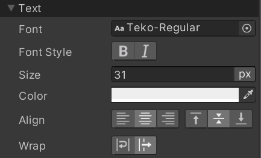
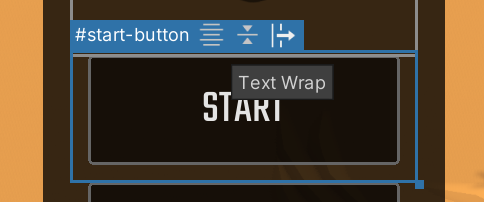

# Styling text

## Basic text styling

Text properties are just regular USS style properties. You can set text style properties on any element, regardless of whether it is a text element (inheriting from `TextElement` C# type) or not. This is because, unlike most USS style properties, text style properties propagate to child elements. Here's a quick example:
```xml
<ui:UXML xmlns:ui="UnityEngine.UIElements" xmlns:uie="UnityEditor.UIElements">
    <ui:VisualElement style="-unity-font-style: bold-and-italic; font-size: 39px;">
        <ui:Label text="Label" />
    </ui:VisualElement>
</ui:UXML>
```
In the example above, the `Label`'s text will be bold, italic, and have a font size of `39px`. Here's a preview of the available text style properties in the **Inspector**:<br>


## Styling text directly in the Canvas

The following text styles are exposed as toggles in the **Canvas** on selected elements:
1. Horizontal Text Align
1. Vertical Text Align
1. Text Wrap

These toggles appear in the header of the blue selection border around the selected element if the selected element is a text element (inherits from `TextElement`), for example, `Label` and `Button`:<br>


## Advanced text styling

[!include[](Snippets/Admonitions/uib-snippet-only-in-2021-1.md)]

You can install the TextMeshPro package (installed by default in new projects) to have the UI Builder expose Rich Text features. These features include:
1. Ability to use rich text tags in `Label` text attributes.
1. Ability to use the more advanced `Font Asset` in style properties, that allows setting text highlights and shadows.