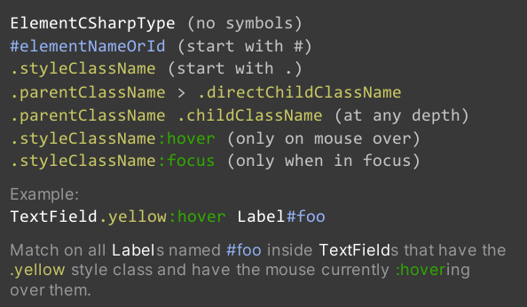
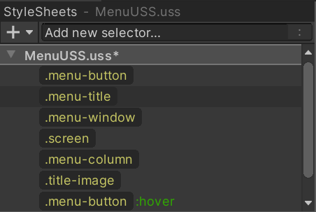
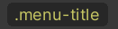
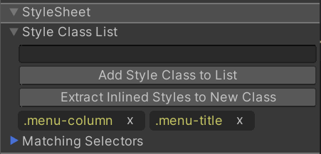

# Using USS Selectors to style many elements

## Managing USS Selectors

USS Selectors are essentially queries into the element hierarchy. They look like this in USS:
```css
.my-button {
    background-color: blue;
}
```
The above USS Selector looks for all elements that have the class (or tag) `.my-button` and any matching elements will get the background color blue.

You can use USS Selectors inside StyleSheets to share styles across many elements and many UI Documents (UXML). You can create a new USS Selectors via the **Add new selector...** field at the top of the **StyleSheets** pane.

When you have the **Add new selector...** field in focus, a USS Selector syntax cheatsheet will appear on top of the **Viewport**. Here it is for your reference:<br>


You can also `cut/copy/paste/delete` one or more USS Selectors in the **StyleSheets** pane by selecting them, right-clicking on one, and choosing the desired action.

When you copy a USS Selector in the **StyleSheets** pane, what actually gets copied to the copy/paste buffer is the USS text representation of the USS Selector. This means you can paste it in a text editor directly or, the opposite, copy some USS text and paste it in the UI Builder.

## Matching USS Selectors to elements

It is recommended to use style classes to match elements instead of their C# type or name attribute. Here's what the **StyleSheets** pane would look like with a few class-based USS Selectors:<br>


You can have a USS Selector match an element by adding a style class (or "tag") used in the USS Selector to the element. You can add a style class to an element in two ways:
1. Drag a style class pill, like , onto the element in either the **Hierarchy** or the **Canvas**.
1. Select the element, then enter the name of the style class in the field at the top of the **StyleSheet** section in the **Inspector** and click the **Add Style Class to List** button:<br>


You can see which style classes are already applied to an element by looking at the yellow style class pills in the **StyleSheet** section of the **Inspector**:<br>


You can double-click on a yellow style class pill to jump to a USS Selector that uses it as its only query, if one exists in the currently attached StyleSheets.

If a yellow style class pill appears faded it means the UI Builder did not find any USS Selector in the attached StyleSheets that has only this class in its query. You can double-click on a faded yellow class pill to create a new USS Selector in the **Active StyleSheet** that only looks for this style class.