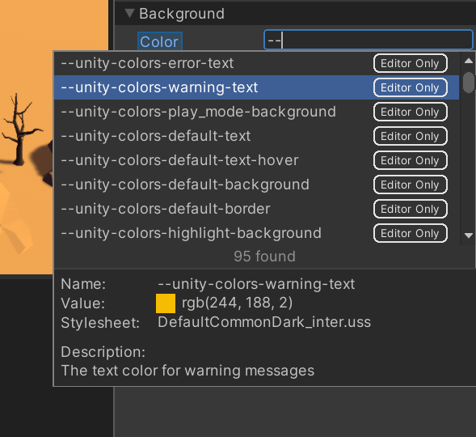
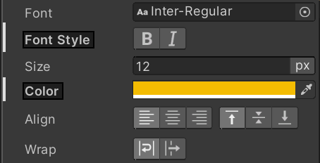

# Using USS Variables

USS Variables are regular USS style properties with custom user-defined names that can hold any style value type. They can then be used in place of a value on any other USS style property. They are primarily used for themes, with the default Unity themes exposing a long list of standard variables to make your UI more consistent with standard controls. Here's a simple example of variable definition and usage in USS:
```CSS
* {
    --my-var: 20px;
}

.my-button {
    width: var(--my-var);
}
```

You can assign a variable to a StyleSheet USS style property in UI Builder via the **Inspector** pane by right-clicking on a style field and selecting **Set Variable**. This option will temporarily convert the style field into a text field (if it is not already a text field) and allow you to input the name of the USS Variable:<br>


As you type the name of the variable, a dropdown will appear showing any found matching variables coming from either:
1. the current Theme being used for authoring context in the UI Builder via the **Theme** dropdown in the **Viewport** toolbar.
1. any assigned StyleSheets to the current UI Document (UXML).
The variable dropdown will also let you select a variable option and see its current value and the StyleSheet asset it is coming from. Pressing **Enter** will set the variable and revert the style field back to its original type.

For style fields that are already text fields, you can also assign a variable by starting to type `--` instead of a number.

You can see which style fields already have a variable assigned by looking at the label of the field and seeing if it is incased in a box:<br>


To remove a variable assignment, simply go into the variable mode via **Set Variable** and delete the variable name.

A few additional points to keep in mind when using USS Variables in UI Builder:
1. USS Variables are not supported in per-element inline styles (in UI Toolkit core). When selecting an element you will still see which style properties are driven by a variable with the field label highlight, but the only option will be to **View Variable**. You can still override the variable with a real value by overriding the inline style property like normal.
1. At this time, USS Variables are most useful for **Editor Extension Authoring**, when using the Editor themes (Dark or Light). As such, you will not see a lot of variables being found when searching via the **Inspector** dropdown by default. Make sure to enable **Editor Extension Authoring** via the **Canvas** settings to see all available Editor variables.
1. Currently, UI Builder does not support creation of new USS Variables. To create a new USS Variable you have to do so in a text editor while editing the StyleSheet directly.