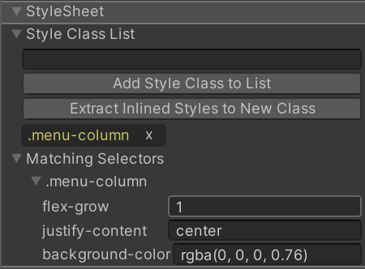

# Debugging your styles

You might run into situations where you don't know where a style is coming from. UI Builder offers several tools to investigate styles.

The quickest way you can see where styles are coming from is to:
1. Select the element in question.
1. Go to the **StyleSheet** section of the **Inspector**.
1. Expand the **Matching Selectors** foldout: 

**Matching Selectors** will display all USS Selectors acting on the current element, in the order in which they are applied. Lower USS Selectors will always override the same style properties in higher USS Selectors. This list of USS Selectors will include both those coming from your own StyleSheets as well as those coming from the default Unity theme.

If the **Matching Selectors** section is not sufficient, you can open the main **UI Toolkit Debugger**, via the **Window > UI Toolkit > Debugger** main menu. The key to make things easier for yourself is to enable **Preview** mode in the UI Builder before using the **UI Toolkit Debugger** to **Pick Element** inside your **Canvas**. **Preview** mode, found in the **Viewport**'s toolbar, removes the UI Builder-specific picking overlay and handles from the **Canvas** - leaving just your UI. Since UI Builder is entirely running using UI Toolkit, including the recreation of your in-progress UI, the **UI Toolkit Debugger** will work like in any other UI Toolkit window.