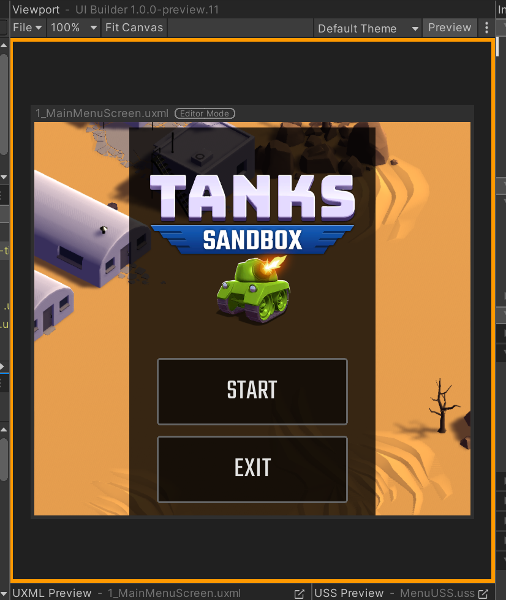

# Testing inside the UI Builder

To test your UI inside the UI Builder, directly inside the **Canvas**, you can enable **Preview** mode, found in the **Viewport**'s toolbar. **Preview** mode removes the UI Builder-specific picking overlay and handles from the **Canvas**. You can tell if you have **Preview** mode enabled by looking for a orange border around the entire **Viewport**: 

With **Preview** mode enabled, the elements of your UI Document (UXML) in the **Canvas** will start receiving input events, letting you test:
1. `:hover` pseudo states to check hover-only styles
1. state-based controls like `Foldout`, which you can click on to expand and see how the reset of the UI reacts
1. input fields like `IntegerField`, where you can test input validation
1. large containers like `ScrollView`, where you can test scrolling up and down

While in **Preview** mode, you can still continue to modify your UI Document (UXML) and StyleSheets using the **StyleSheets** pane, the **Hierarchy** pane, and the **Inspector**. Only **Canvas** picking and manipulators are turned off in **Preview** mode.