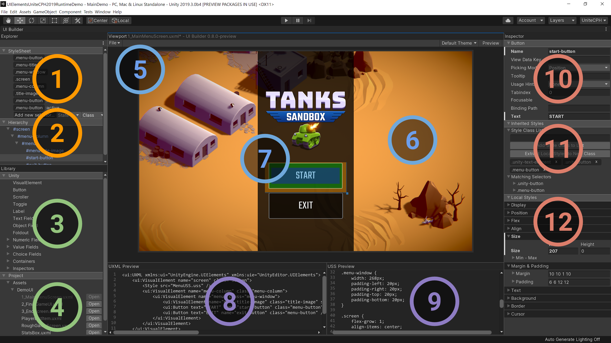

# UI Builder

The **UI Builder** lets you visually create and edit UXML and USS UI assets for **UIElements**. Once the package is installed, the UI Builder window can be opened via the **Window > UI > UI Builder** menu, or double-clicking on a `.uxml` asset in the Project Browser.

## For Early Adopters

The UI Builder is still in preview and we would love to hear your feedback!

- Please **join our [#devs-uibuilder](https://unity.slack.com/archives/CJ3TX00QJ) Slack channel** for feedback and questions!
- Please **fill out this [quick survey](https://docs.google.com/forms/d/e/1FAIpQLSeuzRT8BZQbORCXJUl_CdCMpdgyu5ZJfE3yQldTNU77LfnFgw/viewform)** after using it.

## Installation

Unity versions supported:
- **2019.2**: 2019.2.2f1 or newer
- **2019.3**: 2019.3.0b1 or newer
- **2020.1**: 2020.1.0a2 or newer

This package has not yet been added to the Package Manager UI. To install:
1. Open your project's `Packages/manifest.json`
1. Add:
    ```
    {
      "dependencies": {
        "com.unity.ui.builder": "0.6.2-preview",
        ...
      }
    }
    ```
1. Update the versions to latest (can also be done via the Package Manager UI after this point).

## Documentation



### Explorer
1. Shared Styles: Create USS selectors for sharing common styling between multiple elements.
2. Hierarchy: Current document element tree.
### Library
3. Unity Elements: Built-in Unity elements.
4. Project Elements: Custom user elements like other .uxml templates in the current project.
### Viewport
5. Toolbar: Can Save/Load, change the Theme and activate Preview mode.
6. Currently selected element with manipulation handles.
7. Canvas showing the current document live elements.
### Code Previews
8. UXML Preview: Preview of the generated UXML hierarchy asset.
9. USS Preview: Preview of the generated USS styles asset.
### Inspector
10. Attributes: Change attributes, like element name, that are set in the UXML document.
11. Shared Styles: Add/remove style classes and see which selectors match the current element.
12. Local Style Overrides: Override styles on the current element, inlined in the UXML document.

For a list of all supported features, see our [documentation page](Documentation~/UI.Builder.md).
