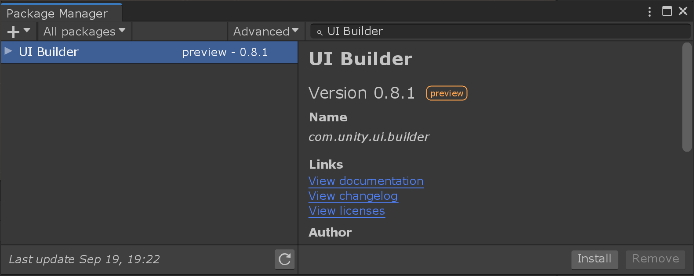
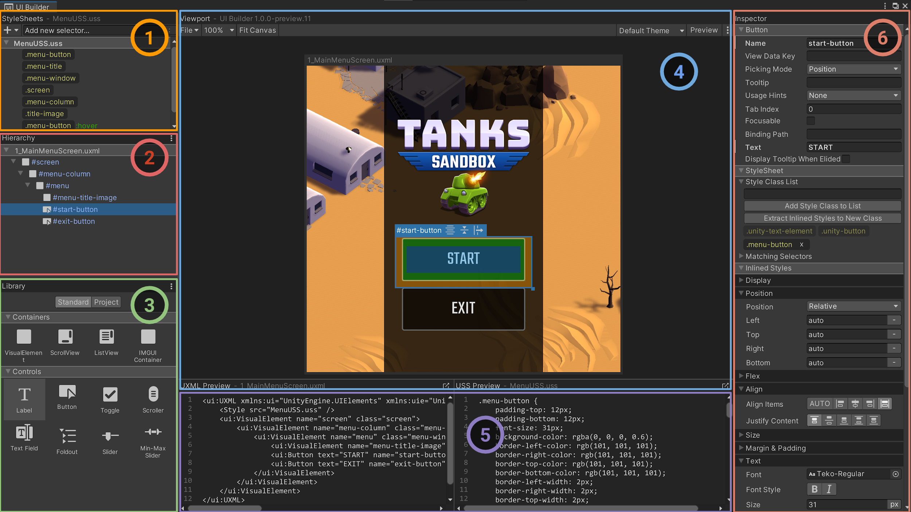

# UI Builder

The **UI Builder** lets you visually create and edit UXML and USS UI assets for **UIElements**. Once the package is installed, the UI Builder window can be opened via the **Window > UI > UI Builder** menu, or double-clicking on a `.uxml` asset in the Project Browser.

**Internal Developers:** Please **join our [#devs-uibuilder](https://unity.slack.com/archives/CJ3TX00QJ) Slack channel** for feedback and questions.

## Installation

Unity versions supported:
- **2019.2**: 2019.2.20f1 or newer
- **2019.3**: 2019.3.0f6 or newer
- **2020.1**: 2020.1.0a22 or newer

To install:
1. Open the **Window > Package Manager**.
1. Enable **Advanced > Show preview Packages**: 
1. Search for `UI Builder`:
1. Press **Install**.

## Documentation

###  Explorer
* **StyleSheet:** Create USS selectors for sharing common styling between multiple elements.
* **Hierarchy:** Current document element tree.
###  Library
* **Unity Elements:** Built-in Unity elements.
* **Project Elements:** Custom user elements like other `.uxml` templates in the current project.
###  Viewport
* **Toolbar:** Can Save/Load, change the Theme and activate Preview mode.
* Currently selected element with manipulation handles.
* Edit-time Canvas for editing and previewing current document with optional edit-time-only background image.
###  Code Previews
* **UXML Preview:** Preview of the generated UXML hierarchy asset.
* **USS Preview:** Preview of the generated USS styles asset.
###  Inspector
* **Attributes:** Change attributes, like element name, that are set in the UXML document.
* **Inherited Styles:** Add/remove style classes and see which selectors match the current element.
* **Local Styles:** Override styles on the current element, inlined in the UXML document.

For more info, see our [documentation page](Documentation~/index.md).
