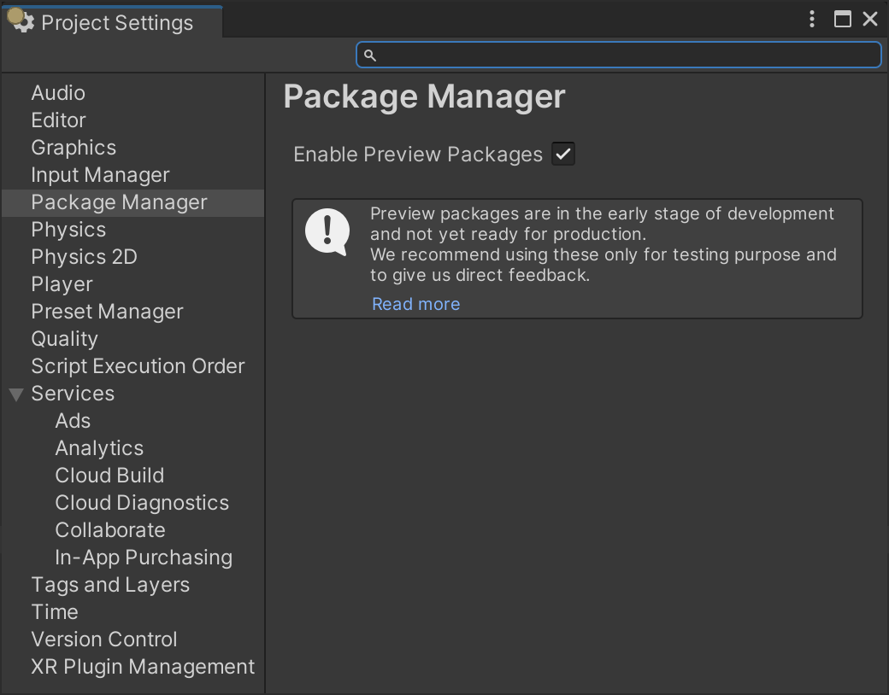

# UI Builder

The **UI Builder** lets you visually create and edit UI assets such as UI documents (`.uxml` files), and stylesheets (`.uss` files), that you use with Unity's **UI Toolkit** (formerly UIElements). After you install the UI Builder package, you can open the UI Builder window from the menu (**Window > UI Toolkit > UI Builder**), or from the Project window (double-click a `.uxml` asset).

> Note: In Unity 2019.x, you open the UI Builder from the **Window > UI > UI Builder** menu.

> Note: UI Builder is the visual authoring tool for UI Toolkit. It does not include runtime support. To enable runtime support in Unity 2020.1 and later, install the UI Toolkit package. For details, see this post on the Unity Forum: https://forum.unity.com/threads/ui-toolkit-1-0-preview-available.927822/.

**Internal Developers:** Please **join our [#devs-uibuilder](https://unity.slack.com/archives/CJ3TX00QJ) Slack channel** for feedback and questions.

## Installation

Unity versions supported:
- **2019.4**: 2019.4.10f1 or newer
- **2020.1**: 2020.1.6f1 or newer
- **2020.2**: 2020.2.0b2 or newer

To install:
1. Open the **Window > Package Manager**.
    * For 2019.x, enable **Advanced > Show preview Packages**: 
    * For newer 2020.1+, go to **Edit > Project Settings... > Package Manager**, and enable check **Enable Preview Packages**:
    
1. Go back to the **Window > Package Manager**.
1. Search for `UI Builder`:
1. Press **Install**.

## Documentation

###  Explorer
* **StyleSheet:** Create USS selectors for sharing common styling between multiple elements.
* **Hierarchy:** Current document element tree.
###  Library
* **Unity Elements:** Built-in Unity elements.
* **Project Elements:** Custom user elements like other `.uxml` templates in the current project.
###  Viewport
* **Toolbar:** Can Save/Load, change the Theme and activate Preview mode.
* Currently selected element with manipulation handles.
* Edit-time Canvas for editing and previewing current document with optional edit-time-only background image.
###  Code Previews
* **UXML Preview:** Preview of the generated UXML hierarchy asset.
* **USS Preview:** Preview of the generated USS styles asset.
###  Inspector
* **Attributes:** Change attributes, like element name, that are set in the UXML document.
* **Inherited Styles:** Add/remove style classes and see which selectors match the current element.
* **Local Styles:** Override styles on the current element, inlined in the UXML document.

For more info, see our [documentation page](Documentation~/index.md).
